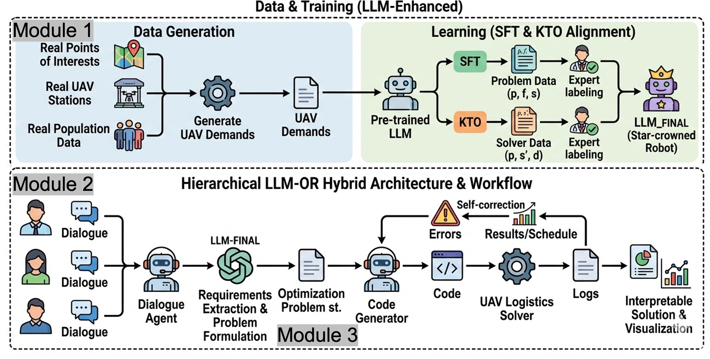

# llm4fairrouting

`llm4fairrouting` is a drone-delivery research project that combines an LLM-driven demand understanding workflow with a shared dynamic routing and CPLEX-based solving core. The repository supports both:

- an end-to-end workflow from demand events to routing results
- a baseline demo that directly uses the CPLEX-based solving core

## Overview

The end-to-end LLM4fairrouting workflow is organized into three modules:

1. `Module 1`: build a fixed LLM-generated dialogue dataset from structured demand events
2. `Module 2`: extract structured delivery demands from dialogues
3. `Module 3`: infer priority/weight settings and solve dynamic routing windows

The data-generation stack also supports a richer training path for LLM2/LLM3 with:

- rich event manifests carrying canonical event truth plus dialogue-control signals
- multi-style dialogues plus automatic dialogue audit
- extracted demands labeled with `extraction_observable_priority`
- training corpora split into `clean_structured`, `pipeline_structured`, and `hard_contrastive`

### Data-Generation Refactor Principles

The current data-generation stack follows a few explicit refactor rules:

- `events_manifest.jsonl` is the canonical event source of truth
- no legacy CSV compatibility path is kept in the main generation flow
- event truth, dialogue control, structured extraction labels, and LLM3 ranking targets are produced in separate stages
- `latent_priority` is the simulator truth anchor, while `extraction_observable_priority` is the main LLM3 supervision label
- `dialogue_observable_priority` is mainly an audit-stage label, and `solver_useful_priority` is mainly an analysis-stage label
- priority rules must stay transparent and human-aligned: scarce delivery capacity should be allocated by concrete need, deadline pressure, vulnerable populations, and operational actionability rather than surface urgency wording alone

`Module 3` is implemented as two connected stages:

- `Module 3a`: priority / weight inference
- `Module 3b`: solver adapter and routing execution

•	提取是否准：precision，recall，f1，exact_match_rate
•	优先级是否准：accuracy，macro_f1，weighted_f1，confusion_matrix
•	规划结果是否好：service_rate，service_rate_loss，final_total_distance_m，final_total_noise_impact，average_delivery_time_h，max_delivery_time_h，n_used_drones
•	帕累托前沿是否有代表性、搜索是否高效：final_total_distance_m，average_delivery_time_h，final_total_noise_impact，service_rate_loss，n_used_drones
•	搜索过程指标frontier_size，n_candidates_evaluated，search_runtime_s，avg_candidate_runtime_s

## Project Workflow Diagram




## Quick Start

```bash
python -m venv .venv
source .venv/bin/activate
pip install -e .[dev]
```

Copy the example environment file first:

```bash
cp .env.example .env
```

Set `OPENAI_API_KEY` in `.env` before running any online Module 1/2/3 command. If you use a compatible gateway, set `OPENAI_BASE_URL` too.

Build the canonical dialogue dataset with:

```bash
./scripts/build_daily_demand_dialogues.sh
```

Run the llm4fairrouting workflow with:

```bash
./scripts/run_workflow.sh
```

Run the baseline with:

```
PYTHONPATH=src python -m llm4fairrouting.baselines.cplex_with_priority_noise
```

Generate the primary rich event manifest with:

```bash
llm4fairrouting-demand-events
```

Generate the richer LLM2/LLM3 training dataset with:

```bash
llm4fairrouting-training-data
```

If the package is not installed in editable mode yet, use:

```bash
PYTHONPATH=src python -m llm4fairrouting.data.demand_event_generation
```


## Repository Layout

- `src/llm4fairrouting/llm/`: LLM-related modules for dialogue generation, demand extraction, and priority inference
- `src/llm4fairrouting/workflow/`: end-to-end workflow entry and solver adapter
- `src/llm4fairrouting/routing/`: shared routing core used by both workflow and baseline
- `src/llm4fairrouting/data/`: seed-path definitions and dataset loaders
- `src/llm4fairrouting/baselines/`: baseline entry points
- `src/llm4fairrouting/config/`: runtime environment and `.env` helpers
- `data/seed/`: seed datasets
- `results/`: workflow run outputs
- `scripts/`: shell wrappers for running the workflow
- `tests/`: unit tests
- `docs/images/`: recommended location for README and documentation figures

### Workflow Modules

| Module | Location | Purpose | Main Input | Main Output |
| --- | --- | --- | --- | --- |
| Module 1 | `src/llm4fairrouting/data/demand_dialogue_dataset.py`, `src/llm4fairrouting/llm/dialogue_generation.py` | Build the fixed seed dialogue dataset from structured demand events with an LLM | `data/seed/daily_demand_events_manifest.jsonl`, optional station file | `data/seed/daily_demand_dialogues.jsonl` |
| Module 2 | `src/llm4fairrouting/llm/demand_extraction.py` | Extract structured delivery demands from dialogues by time window | `data/seed/daily_demand_dialogues.jsonl` | `extracted_demands.json` |
| Module 3 | `src/llm4fairrouting/llm/priority_inference.py`, `src/llm4fairrouting/workflow/solver_adapter.py` | Infer per-demand priority settings and solve routing windows | `extracted_demands.json`, weight configs, station/building data | `weight_configs.json` / `weight_configs/`, `solver_results.json`, `workflow_results.json` |
| Training Builder | `src/llm4fairrouting/data/training_dataset_builder.py` | Build LLM2/LLM3 training data with observable priority labels and hard contrastive windows | rich event manifest or generated seed events | `data/seed/priority_training_dataset/` |

### Demand Event Generation

- File: `src/llm4fairrouting/data/demand_event_generation.py`
- Role: generates seed demand events from `building_information.csv` and emits the canonical rich manifest for the latest LLM2/LLM3 data flow
- Defaults:
  - 5-minute windows across a full day
  - 4-10 demands per window
  - `medical_ratio=0.2`, so about 20% `medical` and 80% `commercial`
  - `medical` demands use priorities `1/2/3` with equal probability; `commercial` demands use priority `4`
  - manifest output carries canonical event fields, `latent_priority`, lightweight `priority_factors`, and `must_mention_factors` / `optional_factors`
- Run:

```bash
llm4fairrouting-demand-events --manifest-output data/seed/daily_demand_events_manifest.jsonl
```

#### EventCore Rule Tables

`EventCore` is currently produced by explicit heuristic rule tables plus bounded random sampling. The rules are centralized in [event_semantics.py](/Users/eveyu/Downloads/githubs/drone-delivery-pipeline/src/llm4fairrouting/data/event_semantics.py) so they stay transparent and can later be externalized into YAML/JSON config without changing the rest of the pipeline.

Current rule families:

- `supply_type + latent_priority -> material candidates`
- `latent_priority -> demand_tier`
- `latent_priority -> deadline_minutes`
- `latent_priority -> requester role options`
- `latent_priority + material_type -> destination options`
- `material_type -> special handling`
- `priority/material/destination -> population_vulnerability heuristic`
- `latent_priority -> receiver_ready probability`
- `(priority, material_type) -> scenario_context` overrides plus safe fallbacks

This means the simulator policy is intended to be legible and reviewable, not hidden inside scattered code paths.

Optional rich manifest output:

```bash
llm4fairrouting-demand-events --manifest-output data/seed/daily_demand_events_manifest.jsonl
```

### Training Dataset Outputs

`llm4fairrouting-training-data` now writes a directory instead of a single monolithic JSON. The default output directory is `data/seed/priority_training_dataset/`, and it contains:

- `events_manifest.jsonl`
- `dialogues.jsonl`
- `llm2_sft.jsonl`
- `llm3_sft_clean.jsonl`
- `llm3_sft_pipeline.jsonl`
- `llm3_grpo_hard.jsonl`
- `quality_report.json`
- `release_manifest.json`
- `dataset_manifest.json`

`dataset_manifest.json` stores the schema version, generation time, sample counts, relative artifact paths, and the active quality-gate thresholds.

`quality_report.json` records shard-level quality metrics such as:

- overall dialogue audit pass rate
- pass rate stratified by priority
- missing must-mention factors
- requester-role recovery quality in pipeline outputs
- hard-case coverage for `surface_contradiction` and `near_tie`

`release_manifest.json` turns those metrics into a release decision:

- `accepted`: shard is ready for `llm2_sft`, `llm3_sft_pipeline`, and `llm3_grpo_hard`
- `needs_regen`: shard still keeps `llm3_sft_clean`, but pipeline / hard slices should not be mixed into the main release yet
- `debug_only`: structural failure; do not train on it

`llm3_grpo_hard.jsonl` now mixes several kinds of hard cases:

- factor-isolated counterfactuals such as tighter deadlines, upgraded requester roles, added cold-chain handling, changed receiver readiness, and stronger vulnerability signals
- surface-vs-structure contradiction windows, where low-need requests can use urgent wording while higher-need requests remain calm and clinical
- near-tie ranking windows, where multiple requests have similar observable priority and require finer ordering

Online generation can also be parallelized:

- `--dialogue-concurrency` controls how many LLM1 dialogue batches are sent concurrently
- `--extraction-concurrency` controls how many LLM2 extraction windows are sent concurrently
- `llm4fairrouting-data-quality <dataset_dir>` recomputes `quality_report.json` and `release_manifest.json`
- `llm4fairrouting-release-manifest <root_dir>` aggregates per-shard release manifests into one batch-level release plan

#### Module 1

- Files: `src/llm4fairrouting/data/demand_dialogue_dataset.py`, `src/llm4fairrouting/llm/dialogue_generation.py`
- Role: builds one fixed LLM-generated dialogue dataset aligned with the seed demand events
- Input:
  - `daily_demand_events_manifest.jsonl`
  - optional station metadata from `drone_station_locations.csv`
- Output:
  - canonical seed dataset: `data/seed/daily_demand_dialogues.jsonl`

#### Module 2

- File: `src/llm4fairrouting/llm/demand_extraction.py`
- Role: groups dialogues by time window and extracts solver-ready structured demands
- Input:
  - `daily_demand_dialogues.jsonl`
- Output:
  - standalone default: `data/drone/extracted_demands.json`
  - workflow run: `results/run_*/extracted_demands.json`

#### Module 3

##### Module 3a: Priority / Weight Inference

- File: `src/llm4fairrouting/llm/priority_inference.py`
- Role: assigns priority, window rank, and supplementary constraints for each demand
- Input:
  - `extracted_demands.json`
- Output:
  - standalone default: `data/drone/weight_configs.json`
  - workflow run: `results/run_*/weight_configs/weight_config_window*.json`

##### Module 3b: Solver Adapter

- File: `src/llm4fairrouting/workflow/solver_adapter.py`
- Role: transforms Module 2 + Module 3a outputs into shared routing-core inputs and executes dynamic solving
- Input:
  - `extracted_demands.json`
  - `weight_configs.json` or `weight_configs/`
  - `data/seed/drone_station_locations.csv`
  - `data/seed/building_information.csv`
- Output:
  - standalone default: `data/drone/solver_results.json`
  - workflow run: `results/run_*/workflow_results.json`
  - analytics sidecar: `*_analytics/solver_analytics.json`, `*_analytics/charts/*.png`

### Baseline

The original baseline entry is:

- file: `src/llm4fairrouting/baselines/cplex_with_priority_noise.py`
- function: `main()`

Run the baseline with:

```bash
PYTHONPATH=src python -m llm4fairrouting.baselines.cplex_with_priority_noise
```

The baseline:

- does not use the LLM pipeline
- loads seed building and station data directly
- generates demand events internally
- reuses the shared routing core in `src/llm4fairrouting/routing/`

An additional seed-aligned baseline is also available:

- file: `src/llm4fairrouting/baselines/cplex_with_seed_priorities.py`
- role: reads `data/seed/daily_demand_events_manifest.jsonl` directly and solves with manifest-aligned priority labels

### Shared Routing Core

The routing core is shared by the workflow and the baseline:

- `src/llm4fairrouting/routing/domain.py`: core entities such as `Point`, `DemandEvent`, and drone states
- `src/llm4fairrouting/routing/path_costs.py`: path planning, distance computation, and noise-cost estimation
- `src/llm4fairrouting/routing/assignment_model.py`: Pyomo/CPLEX assignment model
- `src/llm4fairrouting/routing/simulator.py`: dynamic simulator for time-evolving demand and drone execution
- `src/llm4fairrouting/routing/serialization.py`: serialization helpers for simulation and workflow results
- `src/llm4fairrouting/routing/analytics.py`: convergence traces, Pareto scans, and chart export

### Solver Analytics Outputs

When the solver runs, the project can now export a sidecar analytics directory with:

- `solver_analytics.json`: per-solve model size, objective breakdown, incumbent trace, Gantt tasks, and run summary
- `charts/convergence_curve.png`: incumbent objective improvements over solve time
- `charts/solve_time_vs_problem_size.png`: relationship between solve time and model size
- `charts/drone_schedule_gantt.png`: executed drone schedule
- `pareto/pareto_frontier.json` and `pareto/charts/pareto_frontier.png`: weighted-sum multi-objective scan outputs when `--pareto-scan` is enabled

Useful flags:

```bash
python -m llm4fairrouting.workflow.run_workflow --offline --pareto-scan --enable-conflict-refiner
```
